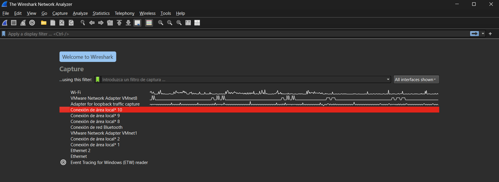
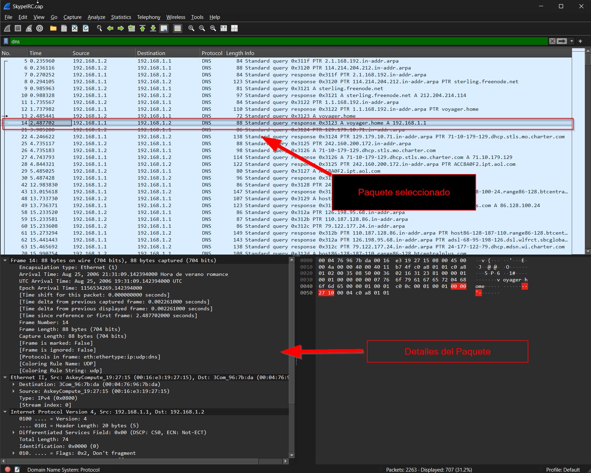
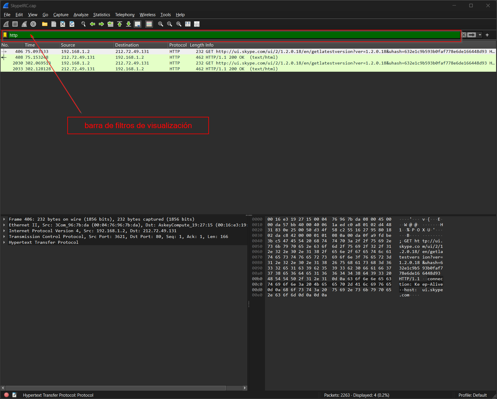
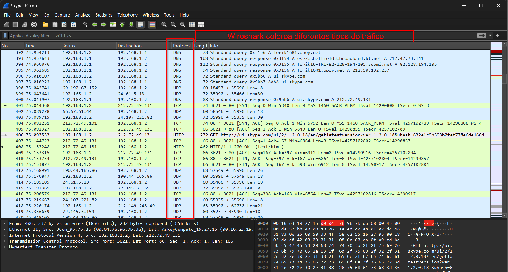

# 🦈 Guía Rápida de Wireshark para Blue Team 🛡️ (Principiantes)

¡Hola! 👋 Bienvenido/a a esta guía rápida y "cheat sheet" de **Wireshark**, la navaja suiza del análisis de redes. Este documento está especialmente diseñado para **principiantes** que se inician en el **Blue Team** (ciberseguridad defensiva).

> **¿Por qué Wireshark es esencial para Blue Team?**
> Te permite **ver** lo invisible: el tráfico de red. Con él puedes investigar alertas, diagnosticar problemas, entender ataques y, en definitiva, **defender mejor** tus sistemas.

---

## 🔍 La Interfaz Básica de Wireshark

Al abrir Wireshark y una captura, te encontrarás principalmente con estas áreas:

1.  **Barra de Menús y Herramientas:** Acceso a todas las funciones.
2.  **Barra de Filtros de Visualización:** ¡Tu mejor amiga! Aquí escribes los filtros.
3.  **Lista de Paquetes:** El corazón de Wireshark. Cada línea es un paquete capturado.
4.  **Detalles del Paquete:** Desglose por capas del paquete seleccionado.
5.  **Bytes del Paquete:** Representación hexadecimal y ASCII del paquete seleccionado.

*Vista general de la interfaz de Wireshark con sus paneles principales.*

*Ejemplo del panel "Detalles del Paquete" mostrando las capas de un paquete seleccionado.*

**Columnas Comunes en la Lista de Paquetes:**

| Columna     | Descripción                                                    |
| :---------- | :------------------------------------------------------------- |
| **No.** | #️⃣ Identificador único del paquete en la captura.              |
| **Time** | 🕒 Timestamp de captura.                                       |
| **Source** | ➡️ IP/MAC de origen.                                          |
| **Dest.** | ⬅️ IP/MAC de destino.                                          |
| **Protocol**| 📜 Protocolo principal (TCP, UDP, HTTP, DNS...).              |
| **Length** | 📏 Tamaño del paquete (bytes).                                 |
| **Info** | ℹ️ Resumen útil (Flags TCP, URL HTTP, tipo DNS...).             |

---

## 🔬 Filtrado: Separando el Grano de la Paja

Wireshark captura *todo* lo que ve. Los filtros son cruciales para encontrar información relevante.

> **Filtros de Captura vs. Filtros de Visualización**
> * **Filtros de Captura:** Se aplican *antes* de capturar. Definen qué se guarda. Menos flexibles. Sintaxis diferente (ej. `host 1.2.3.4`, `port 80`).
> * **Filtros de Visualización:** Se aplican *después* de capturar (o al abrir un archivo). Permiten mostrar/ocultar paquetes dinámicamente. ¡Son los más usados para el análisis! **Nos centraremos en estos.**

*Aplicando un filtro (`dns`) en la barra y viendo el resultado en la lista de paquetes.*

### Operadores para Filtros de Visualización

Combina campos de protocolo (`ip.addr`, `tcp.port`, `http`, `dns.qry.name`, etc.) con operadores:

**Comparación:**

| Operador   | Ejemplo                   | Descripción       |
| :--------- | :------------------------ | :---------------- |
| `==`       | `ip.addr == 1.1.1.1`      | Igual a           |
| `!=`       | `tcp.port != 80`          | Diferente de      |
| `>`        | `frame.len > 1000`        | Mayor que         |
| `<`        | `udp.port < 1024`         | Menor que         |
| `>=`       | `ip.ttl >= 64`            | Mayor o igual que |
| `<=`       | `tcp.window_size <= 14k`  | Menor o igual que |
| `contains` | `http contains "admin"`   | Contiene (texto)  |
| `matches`  | `dns.qry.name matches "evil"` | Coincide Regex    |

**Lógicos:**

| Operador     | Ejemplo                                  | Descripción          |
| :----------- | :--------------------------------------- | :------------------- |
| `&&` o `and` | `ip.src == 10.1.1.5 and tcp.port == 443` | **Y** (ambas ciertas) |
| `||` o `or`  | `udp.port == 53 or tcp.port == 53`       | **O** (una u otra)   |
| `!` o `not`  | `not arp`                                | **NO** (negar)       |
| `^^` o `xor` | `tcp.flags.syn == 1 ^^ tcp.flags.ack == 1` | **O exclusivo** |

---

## 📡 Modos de Captura

* **Modo Promiscuo:** (Por defecto en Ethernet) Captura todo el tráfico que ve la tarjeta, no solo el dirigido a ella.
* **Modo Monitor:** (Wi-Fi, Linux/macOS) Captura tráfico Wi-Fi en un canal sin conectarse a la red.

---

## 🔥 ¡Filtros Esenciales para Blue Team! 🔥

Aquí tu arsenal de filtros de visualización más comunes para defensa:

| Propósito                               | Filtro de Ejemplo                               | Notas Defensivas 🛡️                                                            |
| :-------------------------------------- | :---------------------------------------------- | :------------------------------------------------------------------------------ |
| **IP Específica (Origen o Destino)** | `ip.addr == 1.2.3.4`                            | Aislar actividad de IP sospechosa, servidor crítico, alerta de IOC.           |
| **IP Origen** | `ip.src == 10.0.0.50`                           | Ver todo lo que *envía* una máquina específica.                               |
| **IP Destino** | `ip.dst == 8.8.8.8`                             | Ver todo lo que *recibe* un servidor externo (ej. DNS público).               |
| **Subred Completa** | `ip.addr == 192.168.1.0/24`                     | Analizar tráfico interno de un segmento.                                       |
| **Excluir IP (Quitar Ruido)** | `not ip.addr == 192.168.1.1`                    | Ignorar tráfico conocido (tu máquina, un scanner autorizado...).              |
| **Puerto TCP** | `tcp.port == 443`                             | Ver tráfico de servicio específico (HTTPS, RDP/3389, SSH/22...).               |
| **Puerto UDP** | `udp.port == 53`                              | Analizar tráfico DNS, NTP, SNMP...                                           |
| **Puerto Destino Específico** | `tcp.dstport == 80`                             | Buscar conexiones *entrantes* a un servicio web.                              |
| **Combinar IP y Puerto** | `ip.addr == 1.2.3.4 and tcp.port == 22`         | Investigar SSH hacia/desde una IP específica. ¡Muy potente!                   |
| **Protocolos Clave** | `http` / `dns` / `icmp` / `arp` / `smb` / `smb2`| Centrarse en protocolos específicos para análisis de C2, exfiltración, reconocimiento... |
| **Buscar Texto (Payload)** | `tcp contains "password"`                       | ⚠️ ¡Cuidado! Puede ser lento. Útil para hallar datos sensibles no cifrados. |
| **TCP SYN (Inicio Conexión)** | `tcp.flags.syn == 1 and tcp.flags.ack == 0`     | Detectar inicios de conexión. Muchos seguidos pueden indicar escaneos (SYN Scan). |
| **TCP RST (Reset/Rechazo)** | `tcp.flags.reset == 1`                          | Conexiones fallidas/rechazadas. Puede indicar escaneos, firewalls.            |
| **DNS Queries (Consultas)** | `dns.qry.name contains "malware"`               | Buscar dominios sospechosos consultados.                                        |
| **HTTP GET/POST Requests** | `http.request.method == "GET"`                  | Analizar peticiones web (URLs, parámetros).                                    |
| **Tráfico Broadcast** | `eth.dst == ff:ff:ff:ff:ff:ff`                  | Ver tráfico enviado a todos (ARP, DHCP...).                                   |

> **💡 Consejo Pro:** ¡Combina filtros con `and`, `or`, `not` y paréntesis `()` para refinar tu búsqueda al máximo!
> Ejemplo: `(ip.addr == 10.0.0.5 and http) or (ip.addr == 10.0.0.5 and dns)`

---

## ⌨️ Atajos de Teclado Útiles

* `Ctrl + E`: Iniciar / Detener captura.
* `Ctrl + R`: Reiniciar captura.
* `Ctrl + F`: Buscar dentro de la captura (payload, etc.).
* `Ctrl + O`: Abrir archivo de captura.
* `Ctrl + S`: Guardar captura actual.
* `Ctrl + Q`: Salir de Wireshark.
* `Ctrl + Flecha Abajo` / `F8`: Siguiente paquete.
* `Ctrl + Flecha Arriba` / `F7`: Paquete anterior.
* `Ctrl + G`: Ir a un número de paquete específico.

---

## ⚙️ Barra de Herramientas (Iconos Comunes)

* **🦈 Aleta Azul:** Iniciar captura.
* **🟥 Cuadrado Rojo:** Detener captura.
* **🦈 Aleta Gris:** Reiniciar captura.
* **📂 Carpeta Abierta:** Abrir archivo `.pcap`/`.pcapng`.
* **💾 Disquete:** Guardar captura actual.
* **🔍 Lupa:** Encontrar paquete.
* **⬅️ Flecha Izquierda:** Ir al paquete anterior en el historial.
* **➡️ Flecha Derecha:** Ir al siguiente paquete en el historial.
* **🎨 Paleta Colores:** Activar/Desactivar coloreado de paquetes (¡muy útil!).

*La lista de paquetes coloreada según el protocolo ayuda a identificar el tráfico rápidamente.*

---

## ⬇️ Instalación

* **Descarga Oficial:** [https://www.wireshark.org/download.html](https://www.wireshark.org/download.html) (Windows, macOS, Linux)
* > **💡 Nota:** Wireshark suele venir **preinstalado** en distribuciones Linux de seguridad como **Kali Linux** y **Parrot OS**.

---

## ❗ Nota Ética MUY Importante

> **⚠️ ¡Advertencia!** Capturar y analizar tráfico de red sin la debida **autorización** es ilegal y viola la privacidad. **Utiliza Wireshark únicamente en redes y sistemas donde tengas permiso explícito para hacerlo.** El uso responsable es fundamental.

---

## ❓ Contribuciones y Feedback

¿Ves algún error? ¿Tienes sugerencias? ¡Abre un **Issue** en este repositorio! Todo feedback es bienvenido para mejorar esta guía para futuros principiantes.